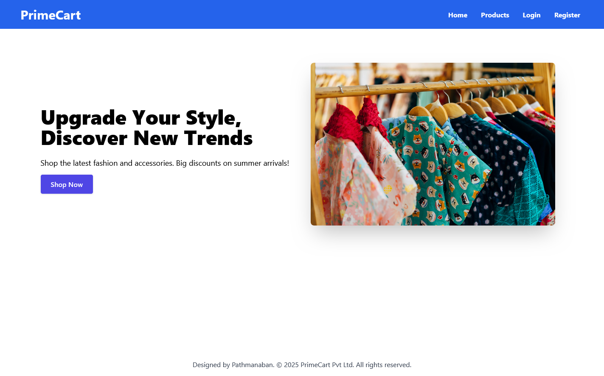
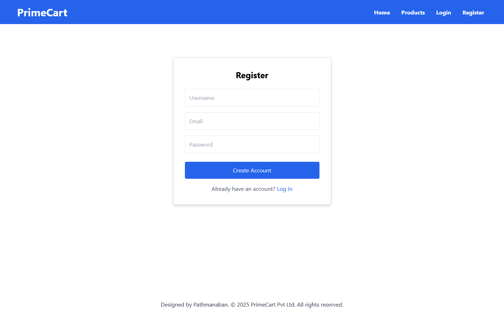
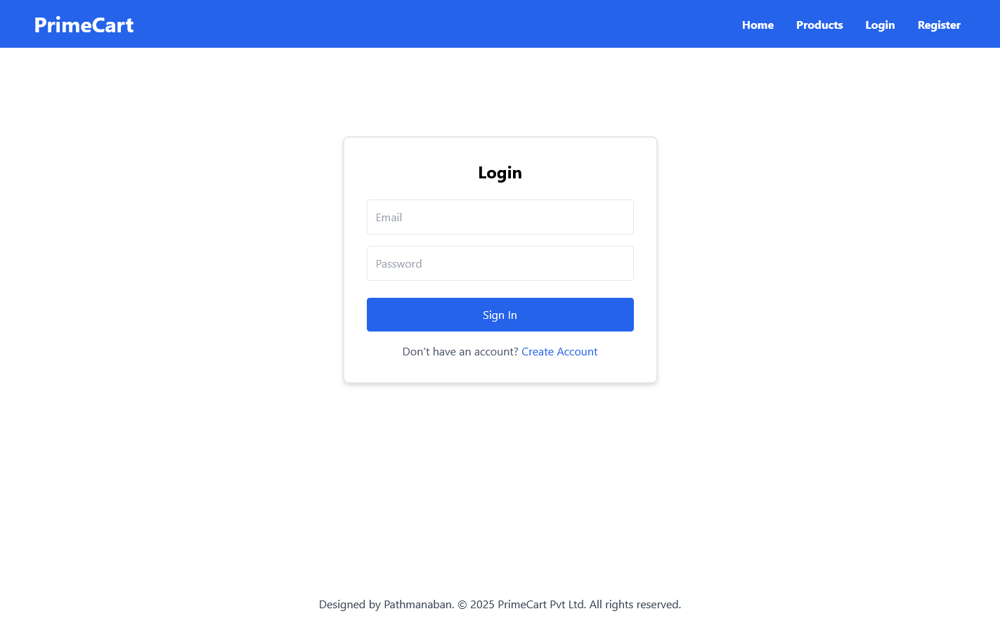
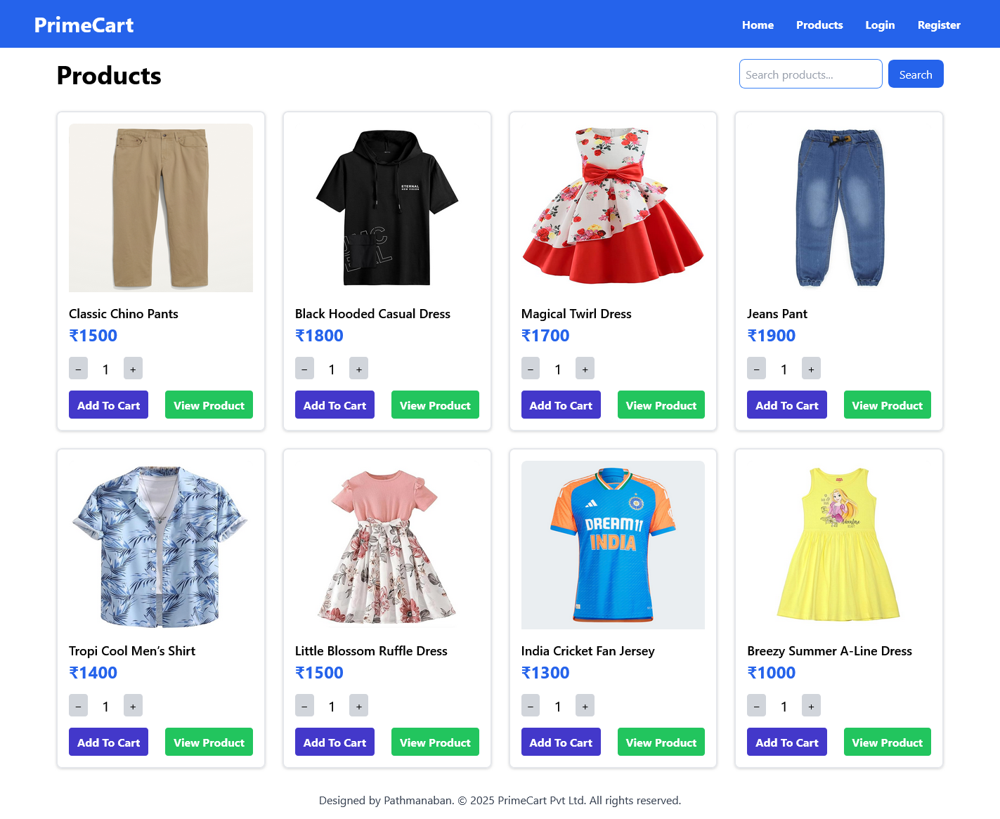
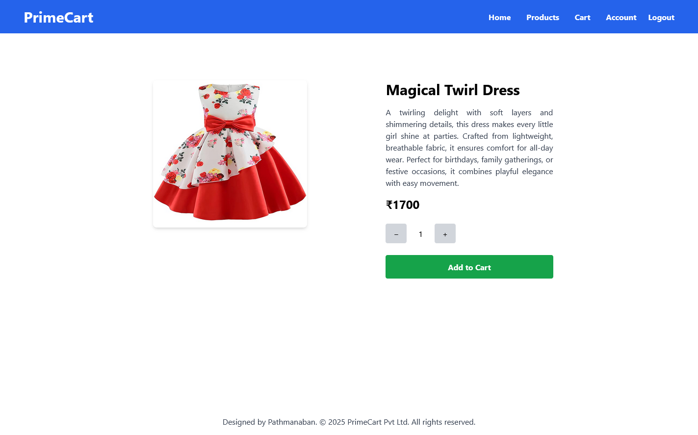
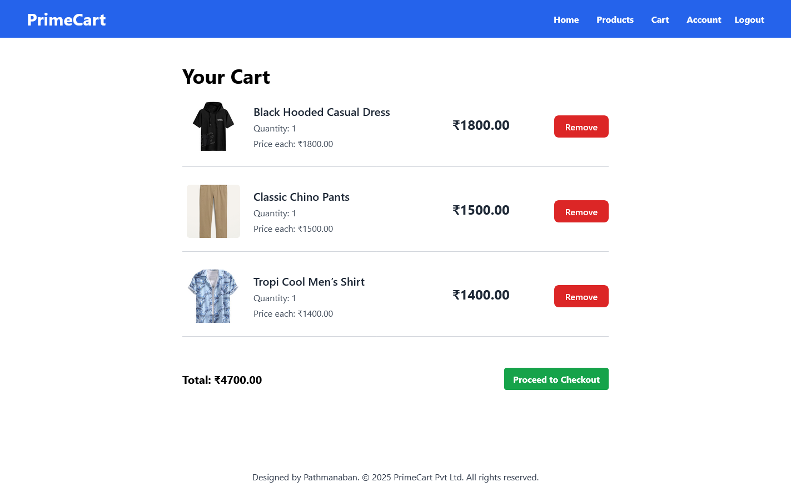
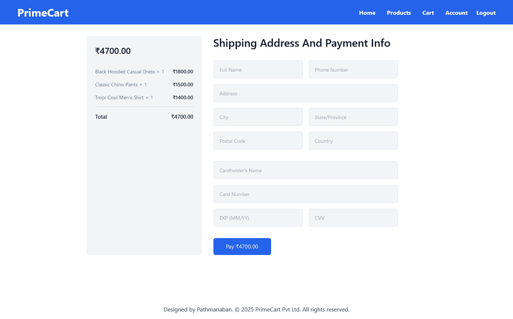
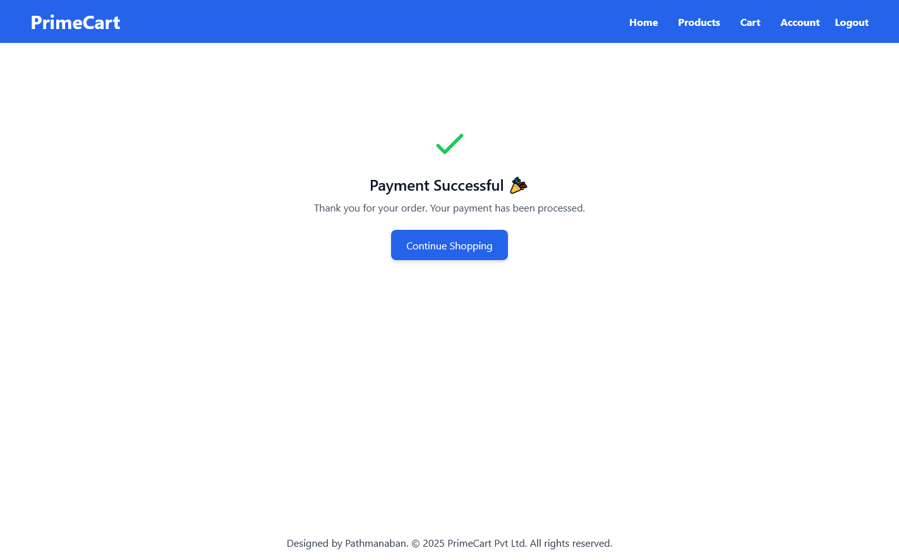
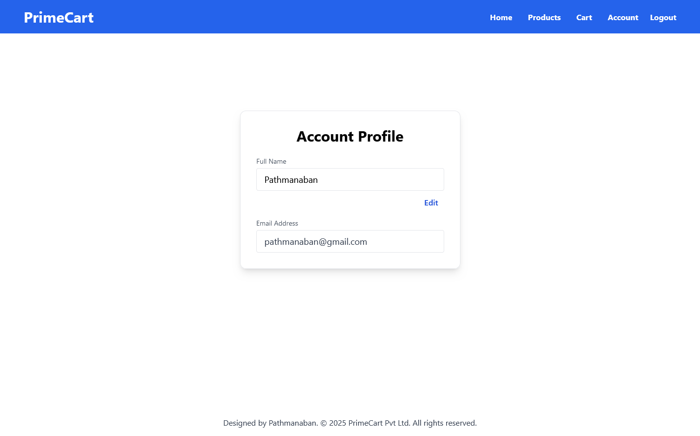
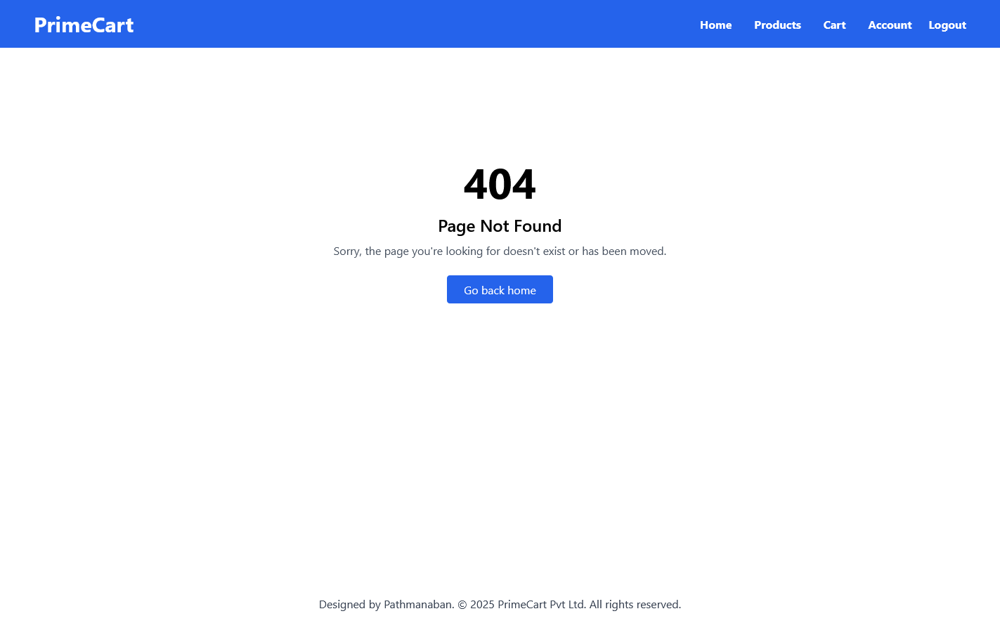

# 🛒 PrimeCart E-Commerce Web Application
A full-featured E-commerce web application built using the **MERN Stack** (MongoDB, Express, React, Node.js). 

---

## 🚀 Features

### 👥 User Functionality
- Register and login with secure HTTP-only JWT authentication (cookies-based)
- Browse & search products
- Add/remove products to cart
- Place orders
- Profile management

### 📦 Tech Stack
- **Frontend**: React, Axios, Tailwind CSS
- **Backend**: Node.js, Express.js
- **Database**: MongoDB (with Mongoose)
- **Authentication:** JWT stored in HTTP-only Secure Cookies

---

## 🧪 To Run My Project on Your Computer

### 1. Clone the Repository

Open the terminal and run:

```bash
git clone https://github.com/pathmanaban666/primecart-mern-ecommerce.git
cd primecart-mern-ecommerce
```

### 2. Navigate to the Backend directory:

```bash
cd Backend
```

### 3. Install backend dependencies:

```bash
npm install
```

### 4. Create a .env file inside the Backend directory and add the following environment variables:

```bash
MONGO_URI=your_mongodb_connection_string
PORT=5000
FRONTEND_URL=http://localhost:3000
JWT_SECRET=your_jwt_secret_key
```

Replace the values as needed for your environment.

### 5. Start the backend server:

```bash
npm start
```

The backend will now be running at: http://localhost:5000

### 6. Navigate to the Frontend directory:

Open a new terminal window and run:

```
cd Frontend
```

### 7. Install frontend dependencies:

```
npm install
```

### 8. Create a .env file inside the Frontend directory and add the following environment variable:

```
REACT_APP_API_BASE_URL=http://localhost:5000
```

Make sure this matches the backend URL and port.

### 9. Start the frontend development server:

```bash
npm start
```

The frontend will now be running at: http://localhost:3000

---

## Screenshots

### Home Page




### Register Page




### Login Page




### Product Listing Page




### Product View Page




### Cart Page




### Checkout Page




### Payment Success Page




### User Account Page




### 404 Page

